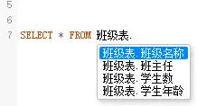

# codemirror-sql-support-chinese
让codemirror sql模式支持中文提示或自动补全
## codemirror简介
据说codemirror是个很强大的代码编辑器，在我使用下来，确实如此。话说CodeMirror 是一款“Online Source Editor”，基于Javascript，短小精悍。本文主要针对codemirror的SQL操作进行，废话不多说，直接进入正题。
## 最终结果

## codemirror自动补全或提示
在我的项目中使用的codemirror版本是5.65.13，不论什么版本的操作方式都大同小异。
- 安装codemirror
安装codemirror的步骤就不说了，大家应该都懂了。
- 引入codemirror
```js
import CodeMirror from 'codemirror'
import 'codemirror/lib/codemirror.css'
// 主题
import 'codemirror/theme/darcula.css'
import 'codemirror/theme/solarized.css'
// 映入sql模式
import 'codemirror/mode/sql/sql.js'
```
- 引入SQL自动提示
```js
// 需要先引入全局自动补全及提示组件和样式
import 'codemirror/addon/hint/show-hint.js'
import 'codemirror/addon/hint/show-hint.css'
// SQL自动补全及提示
import 'codemirror/addon/hint/sql-hint.js'
```
在codemirror的options选项中有个hintOptions（[查阅addon文档](https://codemirror.net/5/doc/manual.html#addons)），在其中可以设置对应的表名、字段等信息，大致代码如下：
```javascript
hintOptions: {
  // 当匹配只有一项的时候是否自动补全
  completeSingle: false,
  tables: {
	// 自定义表名及字段
    用户表: ['用户名', '年龄', '出生年月日', '地址'],
    班级表: ['班级名称', '班主任', '学生数', '学生年龄'],
    教师表: ['姓名', '性别', '年龄', '生日', '电话', '住址']
  }
}
```
如果对codemirror不是太了解，请查阅codemirror官方文档https://codemirror.net/5/doc/
## 如何做到支持中文
默认情况下codemirror仅支持数字、大小写开头的表名或者字段，并不支持中文，因此最直接方法就是修改SQL相关的源码中的正则表达式
### sql.js文件的修改
1. 找到并打开\node_modules\codemirror\mode\sql\sql.js文件
2. 找到大概第**63行**`stream.match(/[a-z][a-z0-9]*/i)`将其修改为`stream.match(/[a-z\u4E00-\u9FFF][a-z0-9]*/i)`
3. 找到大概第**93行**`stream.match(/^[\w\d_$#]+/)`将其修改为`stream.match(/^[\w\d_\u4E00-\u9FFF$#]+/)`
4. 找到大概**116行**`stream.eatWhile(/^[_\w\d]/)`将其修改为`stream.eatWhile(/^[_\w\d\u4E00-\u9FFF]/)`
5. 找到大概**222行**`stream.eatWhile(/\w/) ? "variable-2" : null`修改为`stream.eatWhile(/\w\u4E00-\u9FFF/) ? "variable-2" : null`
6. 找到大概**235行**`stream.eatWhile(/\w/) ? "variable-2" : null`修改为`stream.eatWhile(/\w\u4E00-\u9FFF/) ? "variable-2" : null`
7. 找到大概**259行**`stream.match(/^[0-9a-zA-Z$\.\_]+/)`修改为`stream.match(/^[\u4E00-\u9FFF0-9a-zA-Z$\.\_]+/)`
8. 找到大概**274行**`stream.match(/^[a-zA-Z.#!?]/) ? "variable-2" : null`修改为`stream.match(/^[\u4E00-\u9FFFa-zA-Z.#!?]/) ? "variable-2" : null`
可见，全是正则表达式
### sql-hint.js的修改
1. 找到并打开\node_modules\codemirror\addon\hint\sql-hint.js文件

以上的修改，可能在下一次的`npm install`中会被覆盖，因此建议的做法有以下2种方式（个人推荐第2种方式）
#### codemirror本地安装的方式
将修改过的node_modules/codemirror目录放到项目`根目录`并提交到git，然后重新安装本地目录覆盖即可
```
npm i ./codemirror
```
缺点就是会占用git空间资源
#### 文件替换的方式
将sql.js及sql-hint.js两个文件放到跟目录下的某个目录，采用nodeJS将其复制并替换掉node_modules/codemirror中对应的文件
1. 复制逻辑代码编写
比如我在根目录创建一个目录sql，sql文件夹中包含`sql.js`、`sql-hint.js`，在创建一个copy.js，代码如下：
```js
const fs = require('fs')
const path = require('path')
fs.copyFileSync(path.join(__dirname, './sql.js'), path.join(__dirname, '../node_modules/codemirror/mode/sql/sql.js'))
fs.copyFileSync(path.join(__dirname, './sql-hint.js'), path.join(__dirname, '../node_modules/codemirror/addon/hint/sql-hint.js'))
```
2. package.json的命令处理
```json
"scripts": {
    "dev": "npm run cpySqlCodemirror && cross-env NODE_ENV=development webpack --config ./build/webpack.config.dev.js",
    "build": "npm run cpySqlCodemirror && cross-env NODE_ENV=development webpack --config ./build/webpack.config.prod.js",
    "cp": "node ./sql/copy.js",
  }
```